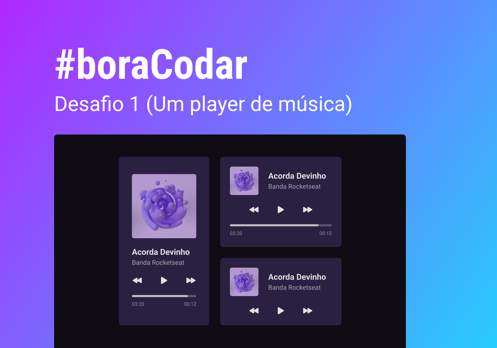

<h1 align="center"> #boraCodar - 01 </h1>

E como funciona?
É super simples: toda semana, às quartas-feiras, nós lançamos um desafio inédito na página oficial do #boraCodar para você codar com a gente. Sem guias ou tutoriais, você fica livre para criar a sua versão. Depois disso, na próxima semana, lançamos um vídeo como esse, com a resolução do desafio.  
<a href="https://www.youtube.com/watch?v=M_eaBcany6Y&ab_channel=Rocketseat">Estude esse projeto em formato de vídeo clicando aqui.</a>

  <a href="#-tecnologias">Tecnologias</a>&nbsp;&nbsp;&nbsp;|&nbsp;&nbsp;&nbsp;
  <a href="#-projeto">Projeto</a>&nbsp;&nbsp;&nbsp;|&nbsp;&nbsp;&nbsp;
  <a href="#-layout">Layout</a>&nbsp;&nbsp;&nbsp;|&nbsp;&nbsp;&nbsp;
  <a href="#memo-licença">Licença</a>

  

 

  

## 🚀 Tecnologias

Esse projeto foi desenvolvido com as seguintes tecnologias:

- HTML e CSS
- JavaScript
- Figma

## 💻 Projeto

Esse é o Desafio #01: #boraCodar um player de música. 

- [Acesse o projeto finalizado, online](https://nicolasxs.github.io/music-player)

- [Assistir aula](https://www.youtube.com/watch?v=M_eaBcany6Y&ab_channel=Rocketseat)

## 🔖 Layout

Você pode visualizar o layout do projeto através [DESSE LINK](https://www.figma.com/community/file/1195050524500542670). É necessário ter conta no [Figma](https://figma.com) para acessá-lo.

## :memo: Licença

Esse projeto está sob a licença MIT.

---

Feito com ♥ by Rocketseat :wave: [Participe da nossa comunidade!](https://discord.gg/rocketseat)
Footer
© 2023 GitHub, Inc.
Footer navigation
Terms
Privacy
Security
Status
Docs
Contact GitHub
Pricing
AP